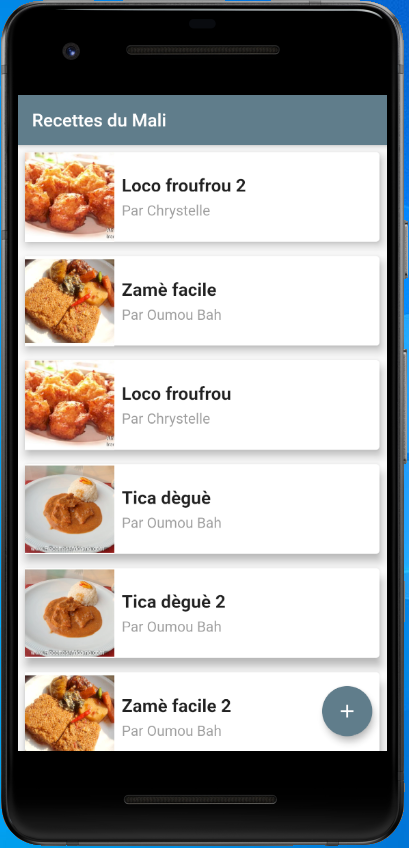
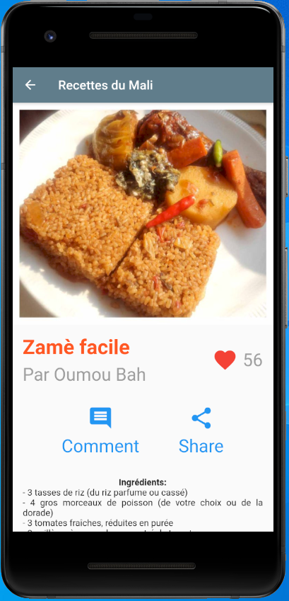
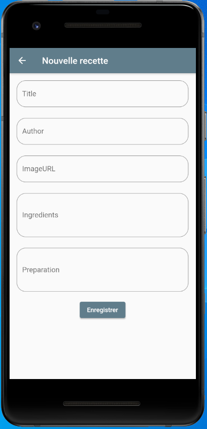

# Recipes App - Flutter UI

This is a teaching flutter application base on the [repository](https://www.github.com/dsilvera/flutter_formation) from David Silvera.
[Watch it on its YouTube channel (in french)](https://www.youtube.com/watch?v=2raikIQfmMY&list=PLVaasf-927w4T1f42loBJDEYbQP1wd9VB)

## Getting Started in Flutter

A few resources to get you started if this is your first Flutter project:

- [Lab: Write your first Flutter app](https://flutter.dev/docs/get-started/codelab)
- [Cookbook: Useful Flutter samples](https://flutter.dev/docs/cookbook)

For help getting started with Flutter, view the official
[online documentation](https://flutter.dev/docs), which offers tutorials,
samples, guidance on mobile development, and a full API reference.

## App UI Features
The app has three pages:
- The home page that display a list of recipes and an add button
  
- The recipe page that display information on a selected the recipe
  
- The add page that display information field for adding a new recipe
  
  
## Used Packages
- [provider](https://pub.dev/packages/provider) and [path_provider](https://pub.dev/packages/path_provider)
- [cached_network_image](https://pub.dev/packages/cached_network_image) and [transparent_image](https://pub.dev/packages/transparent_image)
- [hive](https://pub.dev/packages/hive), [hive_flutter](https://pub.dev/packages/hive_flutter) and [hive_generator](https://pub.dev/packages/hive_generator)
- [flutter_launcher_icons](https://pub.dev/packages/flutter_launcher_icons) and [flutter_icons](https://pub.dev/packages/flutter_icons)
